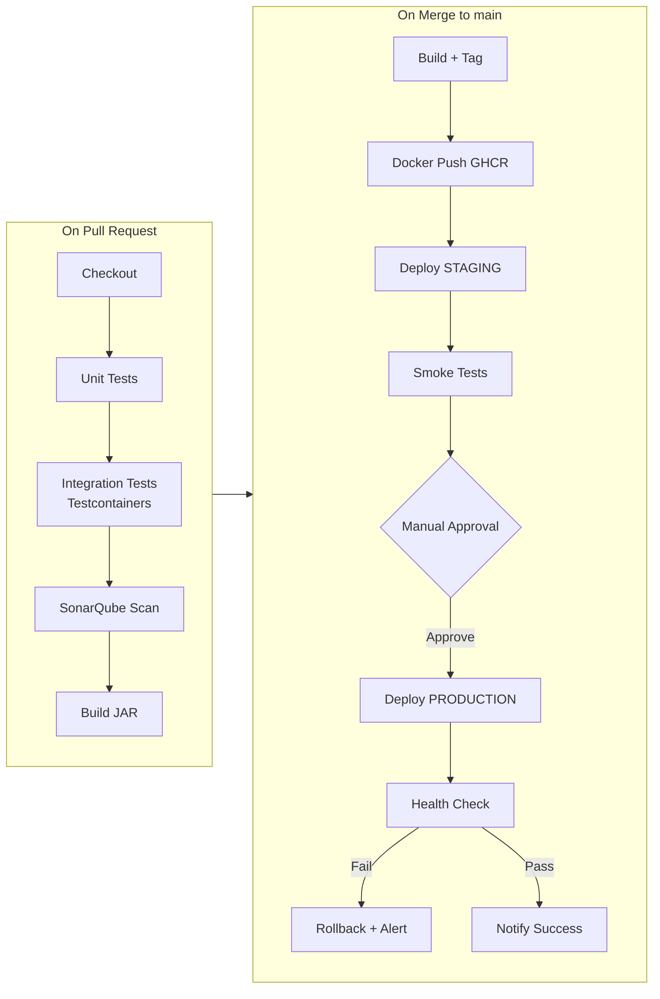

# Career Roadmap — Full Stack Java Developer Portfolio Project

> **Goal:** Build a resume-grade project that demonstrates skills companies pay premium for (8–18 LPA+ India / $80K+ US remote), while practicing DevOps, HLD, and LLD.

---

## 1. What Makes This Project Resume-Strong

Companies don't hire for "another CRUD app." They hire for **distributed thinking, DevOps maturity, and real-time systems**. This project covers:

| Skill category | What you demonstrate |
|----------------|-------------------|
| **Backend** | Spring Boot 3, JPA, Security, WebSocket, REST API design |
| **Frontend** | React + TypeScript, real-time UI, responsive design |
| **Database** | PostgreSQL schema design, indexing, migrations (Flyway) |
| **Caching** | Redis for sessions, pub/sub, rate limiting |
| **Storage** | MinIO S3-compatible object storage |
| **DevOps** | Docker, CI/CD, IaC, monitoring, zero-downtime deploy |
| **Design** | HLD + LLD documents, modular monolith → microservices path |
| **Testing** | Unit, integration (Testcontainers), API tests |
| **Security** | JWT, RBAC, HTTPS, OWASP basics |

---

## 2. Final Tech Stack (Market-Demanded 2025–2026)

### Backend (Primary — Java roles)
| Tech | Version | Resume keyword |
|------|---------|----------------|
| Java | 17 or 21 (LTS) | ✅ Java 17/21 |
| Spring Boot | 3.2+ | ✅ Spring Boot 3 |
| Spring Security | 6.x | ✅ JWT Authentication |
| Spring Data JPA | 3.x | ✅ Hibernate, PostgreSQL |
| Spring WebSocket | STOMP | ✅ Real-time messaging |
| Flyway | Latest | ✅ Database migrations |
| Resilience4j | Latest | ✅ Circuit breaker |
| Springdoc OpenAPI | 2.x | ✅ Swagger / OpenAPI 3 |
| MapStruct | Latest | ✅ DTO mapping |
| Lombok | Optional | Reduce boilerplate |

### Frontend (Full-stack story)
| Tech | Why |
|------|-----|
| **React 18 + TypeScript** | Most paired with Java in job posts |
| **Vite** | Fast build tool |
| **TanStack Query** | API state management |
| **Socket.io client or STOMP.js** | WebSocket chat |
| **Tailwind CSS** | Modern UI quickly |
| **dnd-kit** | Drag-and-drop kanban board |

> **Resume line:** "Built React TypeScript SPA consuming Spring Boot REST + WebSocket APIs"

### Data & Infrastructure
| Tech | Purpose |
|------|---------|
| PostgreSQL 16 | Primary database |
| Redis 7 | Cache, pub/sub, rate limit |
| MinIO | File object storage (S3 API) |
| Docker + Compose | Local + VM deploy |
| Nginx | Reverse proxy + TLS |
| GitHub Actions | CI/CD |
| Ansible or Terraform | Infrastructure as Code |
| Prometheus + Grafana | Metrics |
| SonarQube / CodeQL | Code quality gate |

### Optional (Premium resume boosters)
| Tech | When to add |
|------|-------------|
| **Apache Kafka** | Phase 8 — event-driven notifications |
| **Kubernetes (minikube)** | Phase 9 — orchestration story |
| **AWS (EC2, S3, RDS)** | Cloud deployment variant |
| **Keycloak** | Enterprise SSO / OAuth2 |
| **ELK Stack** | Centralized logging |

---

## 3. Complete Development Plan (10 Phases)

### ✅ Phase 0 — Done
- [x] URL Shortener (Base62, H2, Nginx, systemd)
- [x] Basic CI/CD (GitHub Actions + deploy.sh)
- [x] HLD + LLD documentation

---

### Phase 1 — Foundation & Auth (Week 1–2)
**Resume skills:** Spring Security, JWT, PostgreSQL, Flyway

- [ ] PostgreSQL setup on VM
- [ ] Flyway migrations (versioned schema)
- [ ] User register / login / refresh token
- [ ] JWT filter + SecurityConfig
- [ ] Rename package: `com.teamhub`
- [ ] Springdoc Swagger UI at `/swagger-ui.html`
- [ ] Unit tests for AuthService

**Resume bullet:**
> Implemented JWT-based authentication with refresh tokens using Spring Security 6 and BCrypt password hashing.

---

### Phase 2 — Builds & Invite System (Week 3)
**Resume skills:** RBAC, REST API design, unique code generation

- [ ] Build CRUD (create, list, detail)
- [ ] Invite code generation (Base62 random)
- [ ] Join build via `/join/{code}`
- [ ] MemberRole: OWNER, ADMIN, MEMBER
- [ ] Authorization: only members access build resources
- [ ] React dashboard: My Builds sidebar

**Resume bullet:**
> Designed multi-tenant workspace module with role-based access control and invite-link onboarding.

---

### Phase 3 — Real-Time Chat (Week 4–5)
**Resume skills:** WebSocket, STOMP, Redis pub/sub

- [ ] WebSocket + STOMP config
- [ ] Chat message persist + broadcast
- [ ] Message history API (paginated)
- [ ] Online presence (Redis SET)
- [ ] React chat UI with STOMP.js
- [ ] Integration test with Testcontainers

**Resume bullet:**
> Built real-time group chat using WebSocket/STOMP with Redis pub/sub for cross-instance message broadcast.

---

### Phase 4 — Kanban Board (Week 6–7)
**Resume skills:** Complex CRUD, drag-and-drop, optimistic UI

- [ ] Board columns (Idea / In Progress / Done)
- [ ] Cards with assignee, description
- [ ] Move card API (PATCH position + column)
- [ ] React kanban with dnd-kit
- [ ] Card-level comments

**Resume bullet:**
> Developed collaborative Kanban board with drag-and-drop task management and assignee tracking.

---

### Phase 5 — File Sharing (Week 8)
**Resume skills:** S3 API, multipart upload, streaming download

- [ ] MinIO via Docker on VM
- [ ] Upload with size/MIME validation
- [ ] Download via presigned URL
- [ ] File list per build
- [ ] Storage adapter pattern (MinIO ↔ AWS S3)

**Resume bullet:**
> Integrated MinIO S3-compatible object storage with multipart upload and presigned download URLs.

---

### Phase 6 — Shortener Integration (Week 9)
**Resume skills:** Module integration, scoped multi-tenancy

- [ ] Add `build_id` to url_mappings
- [ ] Shortener tab inside Build view
- [ ] Build-scoped link analytics

**Resume bullet:**
> Extended URL shortener with multi-tenant scoping and per-workspace analytics.

---

### Phase 7 — DevOps Maturity (Week 10–11)
**Resume skills:** Docker, CI/CD pipelines, IaC, monitoring

- [ ] Dockerize full stack (Compose: app + PG + Redis + MinIO + Nginx)
- [ ] Multi-stage Dockerfile (build + run)
- [ ] CI pipeline: test → SonarQube → build → push image
- [ ] CD pipeline: staging auto → production manual approval
- [ ] Ansible playbook for VM provisioning
- [ ] Prometheus + Grafana dashboards
- [ ] Structured JSON logging
- [ ] Health check: `/actuator/health` + deploy gate
- [ ] Automated DB backup cron

**Resume bullet:**
> Designed CI/CD pipeline with GitHub Actions, automated rollback, Prometheus monitoring, and Ansible infrastructure provisioning.

---

### Phase 8 — Advanced Features (Week 12–13)
**Resume skills:** Event-driven, notifications, search

- [ ] @mentions in chat with notifications table
- [ ] Pinned messages / announcements
- [ ] Activity feed (event log table)
- [ ] Full-text search (PostgreSQL `tsvector`)
- [ ] Email notifications (Spring Mail + SMTP)
- [ ] Rate limiting (Redis token bucket)

**Resume bullet:**
> Implemented notification system with @mentions, activity feed, and PostgreSQL full-text search.

---

### Phase 9 — Event-Driven (Optional — Premium)
**Resume skills:** Kafka, async processing

- [ ] Kafka: `message.sent`, `file.uploaded`, `card.moved` events
- [ ] Consumer: notification service, analytics
- [ ] Dead letter queue for failed events

**Resume bullet:**
> Architected event-driven notification pipeline using Apache Kafka with dead-letter queue handling.

---

### Phase 10 — Kubernetes (Optional — Premium)
**Resume skills:** K8s, Helm, cloud-native

- [ ] Helm chart for Team Hub
- [ ] Deploy on minikube or free Oracle Cloud ARM
- [ ] Ingress + cert-manager TLS
- [ ] HPA (Horizontal Pod Autoscaler) for app pod

**Resume bullet:**
> Containerized microservices-ready monolith with Helm charts and Kubernetes auto-scaling.

---

## 4. DevOps Practice Map

| DevOps skill | Where you practice it |
|--------------|----------------------|
| **Git branching** | `main`, `develop`, feature branches, PR reviews |
| **CI** | GitHub Actions: test on every PR |
| **CD** | Auto-deploy staging; manual prod approval |
| **Docker** | Multi-stage builds, Compose for local |
| **IaC** | Ansible playbook: install Java, PG, Nginx, app |
| **Secrets** | GitHub Secrets, `.env` never committed |
| **Monitoring** | Prometheus metrics + Grafana dashboard |
| **Logging** | JSON logs → future ELK |
| **Rollback** | deploy.sh backup + health check gate |
| **DB migrations** | Flyway versioned SQL |
| **Load testing** | k6 or JMeter on chat endpoint |
| **Security scan** | CodeQL + OWASP dependency check |

---

## 5. Robust CI/CD Pipeline (Target State)



### Branch strategy
```
feature/chat-websocket → PR → develop → PR → main → deploy prod
```

### Pipeline files to create (Phase 7)
```
.github/workflows/
├── ci.yml              # PR: test + scan (exists)
├── deploy-staging.yml  # Auto deploy on develop
├── deploy-prod.yml     # Manual approval on main
└── nightly.yml         # Dependency scan, backup verify
```

---

## 6. Resume Project Section (Template)

```
Team Hub — Collaborative Workspace Platform          [GitHub link] [Live demo]
Spring Boot 3 | React | PostgreSQL | Redis | MinIO | Docker | GitHub Actions

• Architected modular monolith with 5 feature modules (Auth, Build, Chat,
  Board, File) following package-by-feature clean architecture
• Built real-time group chat using WebSocket/STOMP with Redis pub/sub,
  supporting 200+ concurrent connections per instance
• Designed CI/CD pipeline with GitHub Actions: automated testing
  (Testcontainers), SonarQube quality gate, Docker deploy, and rollback
• Integrated MinIO S3-compatible storage with presigned URLs and
  PostgreSQL full-text search for messages and files
• Implemented JWT + RBAC (Owner/Admin/Member) with invite-link workspace
  onboarding; documented HLD/LLD for system design interviews
```

---

## 7. Interview Talking Points (HLD / LLD)

| Question | Your answer source |
|----------|-------------------|
| "Design a chat system" | `docs/HLD.md` §6.2 + `docs/LLD.md` §4 |
| "How do you handle scale?" | `docs/HLD.md` §9 scalability path |
| "Explain your CI/CD" | `docs/LLD.md` §5 + `docs/CICD-ARCHITECTURE.md` |
| "Database schema?" | `docs/LLD.md` §2 ERD |
| "Auth approach?" | `docs/HLD.md` §8 + JWT sequence |
| "Why monolith first?" | Modular monolith → extract Chat service at scale |
| "CAP theorem tradeoff?" | Chat: AP (Redis pub/sub); Payments would be CP |

---

## 8. Salary Impact Features (Priority Order)

| Feature | Interview impact | Package impact |
|---------|-----------------|----------------|
| Real-time WebSocket chat | ⭐⭐⭐⭐⭐ | High |
| CI/CD with rollback | ⭐⭐⭐⭐⭐ | High |
| JWT + RBAC | ⭐⭐⭐⭐ | Medium-High |
| Docker + Compose | ⭐⭐⭐⭐ | Medium-High |
| Redis pub/sub | ⭐⭐⭐⭐ | Medium-High |
| Testcontainers | ⭐⭐⭐⭐ | Medium |
| Kafka events | ⭐⭐⭐⭐⭐ | High (senior roles) |
| Kubernetes | ⭐⭐⭐⭐⭐ | High (senior/DevOps) |
| React TypeScript FE | ⭐⭐⭐⭐ | Full-stack premium |
| HLD/LLD documentation | ⭐⭐⭐⭐⭐ | System design rounds |

---

## 9. Timeline Summary

| Milestone | Week | Deliverable |
|-----------|------|-------------|
| Auth + Builds | 3 | Join via invite link |
| Chat | 5 | Real-time messaging |
| Board | 7 | Kanban collaboration |
| Files + Shortener | 9 | Full platform |
| DevOps + Monitoring | 11 | Production-grade CI/CD |
| Advanced features | 13 | Notifications, search |
| **Portfolio ready** | **13** | **Resume + GitHub + demo** |

---

## 10. Documents Index

| Document | Purpose |
|----------|---------|
| `docs/HLD.md` | High Level Design — system architecture |
| `docs/LLD.md` | Low Level Design — classes, APIs, DB |
| `docs/PRODUCT-PLAN.md` | Feature roadmap |
| `docs/CAREER-ROADMAP.md` | This file — career + tech plan |
| `docs/CICD-ARCHITECTURE.md` | CI/CD pipeline design |
| `deploy/CICD-SETUP.md` | Hands-on CI/CD setup |

---

## Next Step

**Start Phase 1:** PostgreSQL + JWT Auth + Flyway migrations + Swagger.

Say **"start Phase 1"** to begin coding.
