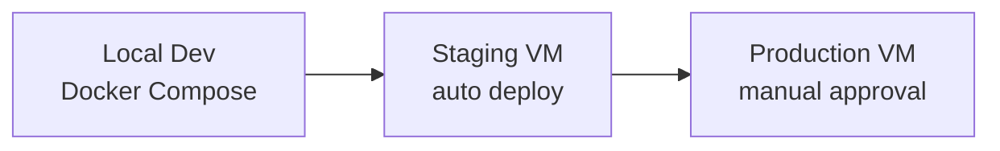
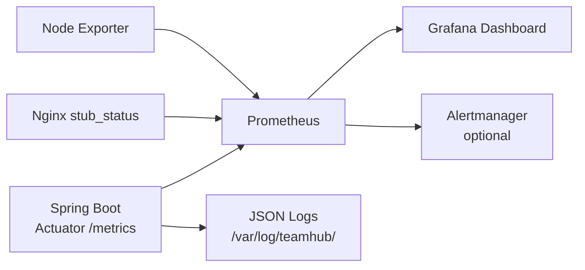

# CI/CD Architecture — Team Hub Platform

> Industry-standard pipeline design for portfolio, DevOps practice, and interviews.

---

## 1. Pipeline Philosophy

| Principle | Implementation |
|-----------|----------------|
| **Every commit is tested** | CI runs on every PR |
| **Main is always deployable** | Only merged PRs with green CI |
| **Automate deploy, not decisions** | Auto staging; manual prod approval |
| **Fast feedback** | CI completes < 10 minutes |
| **Safe rollback** | Backup JAR + health check gate |
| **Observable deploys** | Slack/email notification + metrics |

---

## 2. Environment Strategy



| Environment | Branch | Deploy trigger | URL |
|-------------|--------|----------------|-----|
| **Local** | any | Manual `docker compose up` | localhost |
| **Staging** | `develop` | Auto on push | staging.teamhub.local |
| **Production** | `main` | Manual approval | teamhub.local |

---

## 3. CI Pipeline (On Pull Request)

```yaml
# Trigger: pull_request to main/develop
Steps:
  1. checkout
  2. setup-java 17 (Temurin, Maven cache)
  3. mvn verify                    # unit + integration tests
  4. mvn sonar:sonar               # code quality (optional)
  5. CodeQL security scan          # GitHub native
  6. upload test report artifact
  7. build JAR (no deploy)
```

**Quality gates (PR cannot merge if):**
- [ ] Tests fail
- [ ] Code coverage < 70% (Phase 7+)
- [ ] SonarQube quality gate fails
- [ ] Critical CodeQL findings

---

## 4. CD Pipeline — Staging (Auto)

```yaml
# Trigger: push to develop
Steps:
  1. CI steps (test + build)
  2. docker build + push ghcr.io/user/teamhub:staging-{sha}
  3. SSH to staging VM
  4. docker compose pull && docker compose up -d
  5. wait-for-health: GET /actuator/health (timeout 60s)
  6. run smoke tests:
       - POST /api/auth/login
       - GET /api/builds
  7. notify: staging deploy success
```

---

## 5. CD Pipeline — Production (Manual Approval)

```yaml
# Trigger: push to main
# Requires: environment protection rule "production" with reviewers

Steps:
  1. CI steps (test + build)
  2. docker build + tag :v{version} + :latest
  3. push to GHCR
  4. ⏸ WAIT for manual approval (GitHub Environment)
  5. backup current JAR/image on VM
  6. deploy new version
  7. health check /actuator/health
  8. smoke test suite
  9a. PASS → notify success, tag release
  9b. FAIL → automatic rollback to backup
```

---

## 6. Deploy Strategies

### Current (V1): Rolling restart
```
backup JAR → replace → systemctl restart → health check
Rollback: restore backup JAR + restart
Downtime: ~5–10 seconds
```

### Target (V2): Blue-Green with Docker
```
Green (live) :8080 ← traffic
Blue (new)   :8081 ← deploy here, health check
Nginx switch upstream to Blue
Keep Green for 1h as rollback
Downtime: 0 seconds
```

### Target (V3): Kubernetes rolling update
```
kubectl set image deployment/teamhub app=ghcr.io/...:v2
K8s rolling update with readiness probe
Automatic rollback on failed readiness
```

---

## 7. Infrastructure as Code

### Ansible (VM provisioning)
```yaml
# ansible/playbook.yml
- hosts: teamhub_vms
  roles:
    - common          # apt update, firewall
    - docker          # Docker + Compose
    - postgresql      # PG 16 install + DB create
    - redis           # Redis 7
    - minio           # MinIO bucket
    - nginx           # TLS + reverse proxy
    - teamhub         # Deploy app service
    - monitoring      # Prometheus node exporter
```

### Terraform (cloud variant — optional)
```hcl
# terraform/main.tf
resource "aws_instance" "teamhub" { ... }
resource "aws_rds_instance" "postgres" { ... }
resource "aws_s3_bucket" "files" { ... }
```

**Resume line:** "Provisioned infrastructure using Ansible playbooks with idempotent VM configuration."

---

## 8. Secrets Management

| Secret | Storage | Never |
|--------|---------|-------|
| `JWT_SECRET` | GitHub Secret → VM env | In code/git |
| `DB_PASSWORD` | GitHub Secret → VM env | In application.yml |
| `VM_SSH_KEY` | GitHub Secret | On developer machine unencrypted |
| `MINIO_ACCESS_KEY` | VM env / Docker secret | In Dockerfile |

---

## 9. Monitoring & Alerting Post-Deploy



**Key metrics to track:**
- `http_server_requests_seconds` — API latency p95
- `jvm_memory_used_bytes` — memory pressure
- `hikaricp_connections_active` — DB pool
- `websocket_connections_active` — chat load
- `deploy_timestamp` — last successful deploy

**Health endpoints:**
```
GET /actuator/health        → {"status":"UP"}
GET /actuator/health/liveness
GET /actuator/health/readiness  → checks DB + Redis + MinIO
```

---

## 10. Database Migration in CI/CD

```
Flyway migrations in src/main/resources/db/migration/
  V1__create_users.sql
  V2__create_builds.sql
  V3__create_chat.sql
  ...

CI: Flyway validate (no drift)
CD: Flyway migrate runs on app startup (spring.flyway.enabled=true)
Rollback: write compensating V{n+1}__rollback_xxx.sql (never delete migrations)
```

---

## 11. Complete Workflow File Plan

```
.github/
├── workflows/
│   ├── ci.yml                 ✅ exists — PR tests
│   ├── deploy.yml             ✅ exists — prod SSH deploy
│   ├── deploy-staging.yml     Phase 7 — auto staging
│   ├── deploy-prod.yml        Phase 7 — manual approval
│   ├── codeql.yml             Phase 7 — security scan
│   └── nightly.yml            Phase 7 — backup + dep scan
├── CODEOWNERS                 Phase 7 — require review
└── dependabot.yml             Phase 7 — auto dependency PRs
```

---

## 12. DevOps Skills Checklist (for resume)

- [x] Git + GitHub + branch strategy
- [x] GitHub Actions CI (build + test)
- [x] GitHub Actions CD (SSH deploy + rollback)
- [ ] Docker multi-stage build
- [ ] Docker Compose full stack
- [ ] Ansible VM provisioning
- [ ] Flyway DB migrations in pipeline
- [ ] Prometheus + Grafana monitoring
- [ ] Staging + production environments
- [ ] Manual approval gate for production
- [ ] Blue-green zero-downtime deploy
- [ ] k6 load test in CI
- [ ] Kubernetes + Helm (optional)

---

## 13. Interview Answer: "Design a CI/CD pipeline"

**30-second pitch:**
> We use GitHub Actions with a three-environment strategy. Every PR triggers CI — unit tests, Testcontainers integration tests, and SonarQube scan. Merges to develop auto-deploy to staging via Docker Compose with smoke tests. Production requires manual approval, deploys a versioned Docker image, runs health checks against Actuator endpoints, and automatically rolls back on failure. Database changes are managed by Flyway versioned migrations. Infrastructure is provisioned with Ansible, and Prometheus monitors deploy health.

---

*Companion documents: HLD.md, LLD.md, CAREER-ROADMAP.md, deploy/CICD-SETUP.md*
