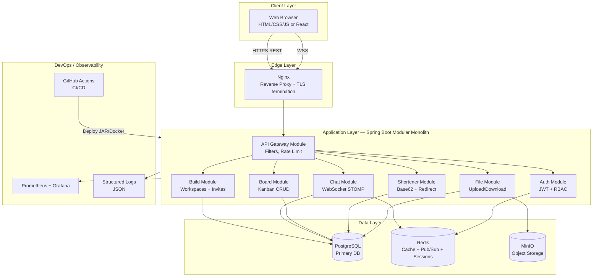
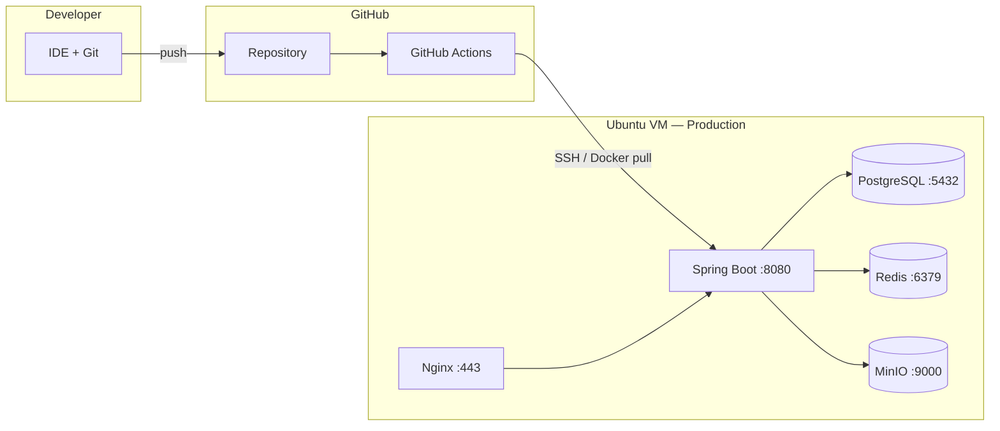

# High Level Design (HLD) — Team Hub Platform

> **Purpose:** System-level architecture for interviews, design reviews, and resume portfolio.  
> **Project:** Collaborative workspace platform (Builds, Chat, Board, Files, URL Shortener)

---

## 1. Problem Statement

Teams need a self-hosted platform to create project workspaces ("Builds"), invite members via link, collaborate through real-time chat and kanban boards, share files, and shorten URLs — without relying on paid SaaS tools.

---

## 2. Goals & Non-Functional Requirements

| NFR | Target |
|-----|--------|
| **Availability** | 99.5% uptime (single VM); 99.9% with HA setup |
| **Latency** | Chat delivery < 200ms (same region) |
| **Scalability** | 500 concurrent users per VM; horizontal scale via K8s later |
| **Security** | JWT auth, RBAC, HTTPS, input validation |
| **Data durability** | PostgreSQL backups daily; MinIO versioning |
| **Deploy frequency** | Multiple deploys/day via CI/CD |
| **Recovery** | Rollback < 2 min; RPO 24h, RTO 15 min |

---

## 3. System Context Diagram

```mermaid
C4Context
    title System Context — Team Hub

    Person(user, "Team Member", "Creates builds, chats, collaborates")
    System(hub, "Team Hub Platform", "Spring Boot app on Ubuntu VM")
    System_Ext(dns, "DNS / Router", "Resolves domain to VM")
    System_Ext(github, "GitHub", "Source code + CI/CD")
    System_Ext(email, "Email SMTP", "Optional notifications")

    user --> dns : Opens https://teamhub.local
    dns --> hub : Routes traffic
    user --> hub : HTTPS / WSS
    github --> hub : Auto-deploy via SSH
    hub --> email : Send invite/notification emails
```

---

## 4. Container / Component Diagram



---

## 5. Deployment Architecture



**Environment tiers:**

| Env | Purpose | URL |
|-----|---------|-----|
| **Local** | Dev on laptop | `localhost:8080` |
| **Staging** | Pre-prod testing | `staging.teamhub.local` |
| **Production** | Live users | `teamhub.local` |

---

## 6. Key Data Flows

### 6.1 User joins Build via invite link

```
User → GET /join/{code} → Auth check → BuildMemberService.join()
      → Insert build_members → Redirect to /builds/{id}/chat
```

### 6.2 Real-time chat message

```
User → WS /app/build/{id}/send → ChatController
     → Save chat_messages (PostgreSQL)
     → Publish to Redis channel
     → Broadcast /topic/build/{id} → All connected members
```

### 6.3 File upload

```
User → POST /api/builds/{id}/files (multipart)
     → Validate member + virus scan (optional)
     → Upload to MinIO bucket
     → Save metadata in files table
     → Return download URL
```

### 6.4 CI/CD deploy

```
git push main → GitHub Actions: test → build → scan
             → SCP/Docker push → VM deploy script
             → Health check /actuator/health
             → Rollback on failure
```

---

## 7. Technology Choices (Market-Aligned)

| Layer | Technology | Why companies use it |
|-------|------------|----------------------|
| Language | **Java 17/21** | Enterprise standard, LTS |
| Framework | **Spring Boot 3.x** | #1 Java backend framework |
| Security | **Spring Security + JWT** | Industry auth pattern |
| API | **REST + OpenAPI 3** | Contract-first, Swagger UI |
| Real-time | **WebSocket + STOMP** | Slack/Discord-style chat |
| Database | **PostgreSQL 16** | ACID, JSON, full-text search |
| Cache | **Redis 7** | Sessions, pub/sub, rate limits |
| Object storage | **MinIO** (S3 API) | AWS S3 compatible, self-hosted |
| Frontend | **React 18 + TypeScript** | Most demanded FE combo with Java |
| Build | **Maven** | Standard Java build |
| Container | **Docker + Compose** | Portable deploy |
| Orchestration | **Kubernetes** (optional) | Scale story for resume |
| CI/CD | **GitHub Actions** | Widely used, free tier |
| IaC | **Terraform / Ansible** | DevOps resume must-have |
| Monitoring | **Prometheus + Grafana** | CNCF standard |
| Logging | **SLF4J + JSON logs** | ELK-ready structured logs |
| Testing | **JUnit 5 + Testcontainers** | Integration tests with real DB |
| Quality | **SonarQube / CodeQL** | Code quality gates in CI |

---

## 8. Security Architecture

| Concern | Solution |
|---------|----------|
| Authentication | JWT access token (15 min) + refresh token (7 days) |
| Authorization | RBAC: OWNER, ADMIN, MEMBER per Build |
| Transport | TLS 1.3 via Nginx + Let's Encrypt |
| Input validation | Jakarta Validation + OWASP encoding |
| Rate limiting | Redis token bucket per IP/user |
| Secrets | GitHub Secrets + VM env vars (never in code) |
| File upload | Max size, MIME whitelist, optional ClamAV scan |

---

## 9. Scalability Path

| Stage | Users | Architecture |
|-------|-------|--------------|
| **V1** | < 500 | Single VM, modular monolith |
| **V2** | 500–5K | Separate Redis, read replica PG |
| **V3** | 5K+ | Extract Chat to microservice, Kafka events |
| **V4** | 50K+ | Kubernetes, multi-AZ, CDN for files |

**Resume pitch:** "Designed modular monolith with clear extraction boundaries for future microservices."

---

## 10. Resume Bullet Mapping

| HLD Topic | Resume line |
|-----------|-------------|
| Modular monolith | Architected 5-module Spring Boot platform serving REST + WebSocket |
| PostgreSQL + Redis + MinIO | Integrated polyglot persistence: relational, cache, object storage |
| CI/CD | Built GitHub Actions pipeline with automated test, deploy, rollback |
| Security | Implemented JWT + RBAC with role-based Build access control |
| Real-time | Designed WebSocket chat with Redis pub/sub for horizontal scale |

---

*Document version: 1.0 | Author: Team Hub Project | Last updated: 2026*
