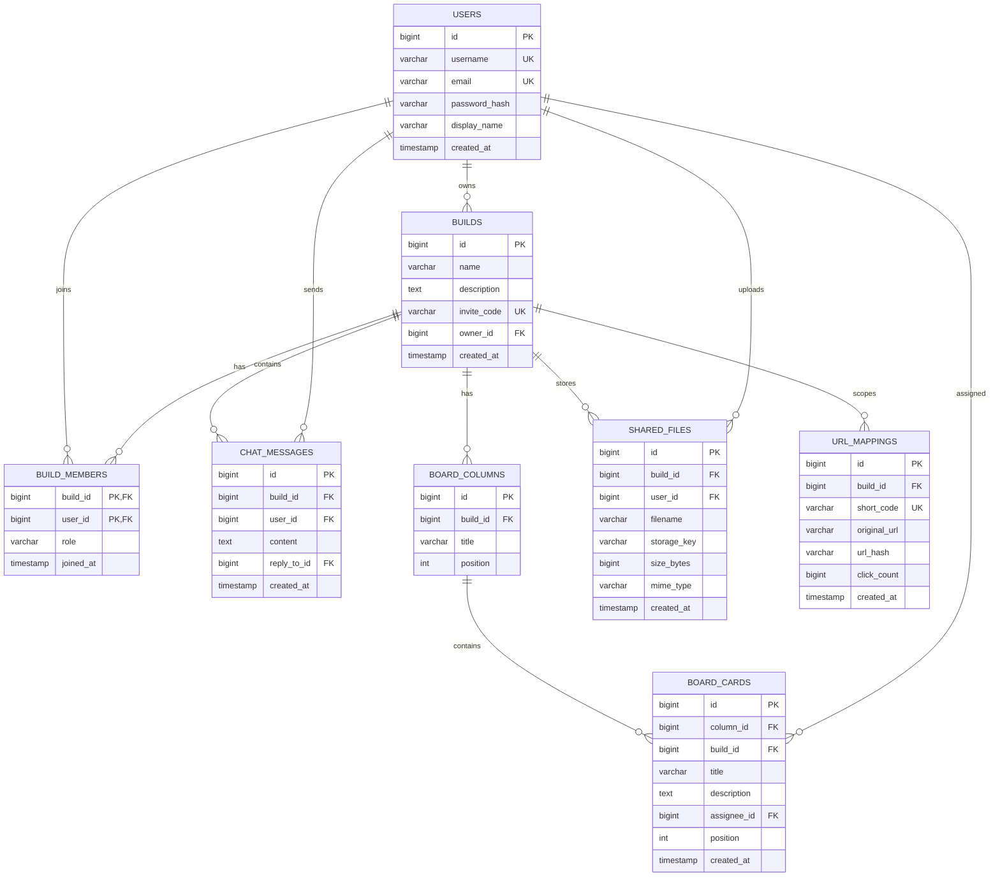
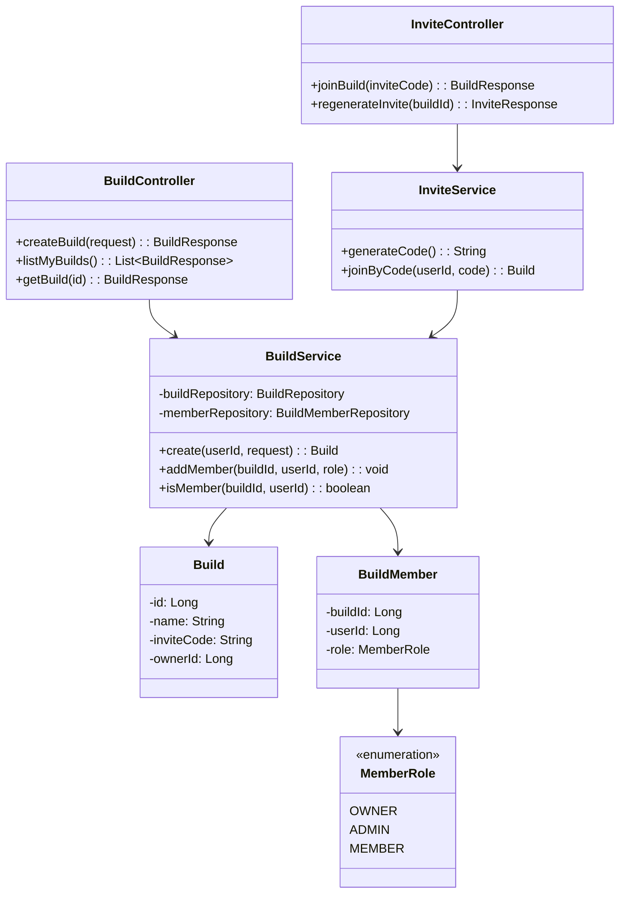
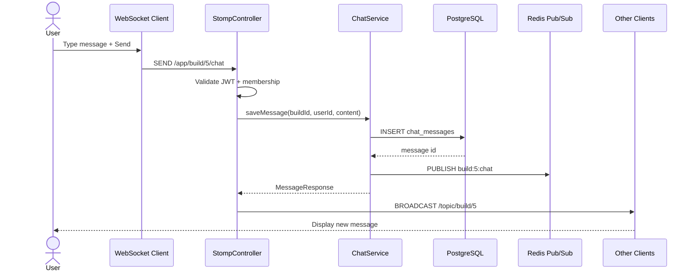
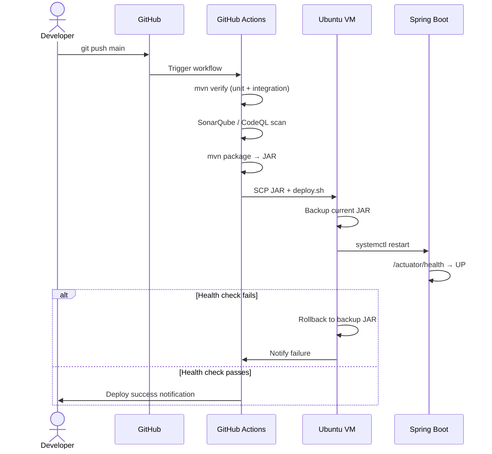

# Low Level Design (LLD) — Team Hub Platform

> **Purpose:** Class-level, API-level, and database-level design for implementation and interviews.

---

## 1. Package Structure (Modular Monolith)

```
com.teamhub
├── TeamHubApplication.java
├── common/
│   ├── exception/          GlobalExceptionHandler, ErrorResponse
│   ├── security/           JwtFilter, SecurityConfig, UserPrincipal
│   └── util/               Base62, DateUtils
├── auth/
│   ├── controller/         AuthController
│   ├── service/            AuthService, JwtTokenProvider
│   ├── dto/                LoginRequest, RegisterRequest, TokenResponse
│   ├── entity/             User
│   └── repository/         UserRepository
├── build/
│   ├── controller/         BuildController, InviteController
│   ├── service/            BuildService, InviteService
│   ├── entity/             Build, BuildMember, MemberRole (enum)
│   └── repository/         BuildRepository, BuildMemberRepository
├── chat/
│   ├── controller/         ChatRestController, ChatWsController
│   ├── service/            ChatService, PresenceService
│   ├── entity/             ChatMessage
│   ├── dto/                SendMessageRequest, MessageResponse
│   └── config/             WebSocketConfig, StompAuthInterceptor
├── board/
│   ├── controller/         BoardController
│   ├── service/            BoardService, CardService
│   ├── entity/             BoardColumn, BoardCard
│   └── repository/         ColumnRepository, CardRepository
├── file/
│   ├── controller/         FileController
│   ├── service/            FileStorageService (MinIO adapter)
│   ├── entity/             SharedFile
│   └── repository/         FileRepository
└── shortener/
    ├── controller/         ShortUrlController, RedirectController
    ├── service/            UrlShorteningService
    ├── entity/             UrlMapping
    └── util/               Base62
```

**Design pattern:** Package-by-feature (not layer-by-layer) — each module owns its MVC stack.

---

## 2. Entity Relationship Diagram



---

## 3. Class Diagram — Build Module (Example)



---

## 4. Sequence Diagram — Send Chat Message



---

## 5. Sequence Diagram — CI/CD Deploy



---

## 6. API Contract (OpenAPI Summary)

### Auth
| Method | Path | Description |
|--------|------|-------------|
| POST | `/api/auth/register` | Create account |
| POST | `/api/auth/login` | Returns JWT + refresh token |
| POST | `/api/auth/refresh` | Refresh access token |

### Builds
| Method | Path | Description |
|--------|------|-------------|
| POST | `/api/builds` | Create new Build |
| GET | `/api/builds` | List user's Builds |
| GET | `/api/builds/{id}` | Build details |
| POST | `/api/builds/join/{inviteCode}` | Join via invite link |
| GET | `/api/builds/{id}/members` | List members |

### Chat
| Method | Path | Description |
|--------|------|-------------|
| GET | `/api/builds/{id}/messages?limit=50` | Message history |
| WS | `/ws` → `/app/build/{id}/chat` | Send message (STOMP) |
| SUB | `/topic/build/{id}` | Receive messages |

### Board
| Method | Path | Description |
|--------|------|-------------|
| GET | `/api/builds/{id}/board` | Columns + cards |
| POST | `/api/builds/{id}/board/columns` | Add column |
| POST | `/api/builds/{id}/board/cards` | Add card |
| PATCH | `/api/board/cards/{id}/move` | Move card to column |

### Files
| Method | Path | Description |
|--------|------|-------------|
| POST | `/api/builds/{id}/files` | Upload (multipart) |
| GET | `/api/builds/{id}/files` | List files |
| GET | `/api/files/{id}/download` | Download stream |

### Shortener
| Method | Path | Description |
|--------|------|-------------|
| POST | `/api/builds/{id}/shorten` | Create short URL |
| GET | `/{shortCode}` | Redirect (public) |

---

## 7. Design Patterns Used

| Pattern | Where | Why |
|---------|-------|-----|
| **Repository** | All JPA modules | Decouple persistence |
| **Service Layer** | Business logic | Transaction boundaries |
| **DTO / Record** | API boundary | Hide entity internals |
| **Strategy** | FileStorageService | Swap MinIO ↔ AWS S3 |
| **Observer / Pub-Sub** | Redis + WebSocket | Broadcast chat events |
| **Factory** | InviteService | Generate unique invite codes |
| **Builder** | Complex API responses | Readable object construction |
| **Filter Chain** | JwtFilter | Cross-cutting auth |
| **Circuit Breaker** | Resilience4j on MinIO calls | Fault tolerance |

---

## 8. Key Algorithms

### 8.1 Invite Code Generation
```
code = Base62(random 48-bit) → 8 chars, collision check in DB
Complexity: O(1) average with unique index
```

### 8.2 URL Shortening (existing)
```
id = auto-increment → shortCode = Base62(id)
Dedup: SHA-256(originalUrl) indexed lookup
```

### 8.3 Rate Limiter (Redis)
```
Key: rate:{userId}:{endpoint}
Algorithm: Token bucket, 100 req/min per user
```

---

## 9. Database Indexes

```sql
CREATE UNIQUE INDEX idx_builds_invite_code ON builds(invite_code);
CREATE INDEX idx_members_user ON build_members(user_id);
CREATE INDEX idx_messages_build_created ON chat_messages(build_id, created_at DESC);
CREATE INDEX idx_cards_column ON board_cards(column_id, position);
CREATE UNIQUE INDEX idx_url_short_code ON url_mappings(short_code);
CREATE INDEX idx_files_build ON shared_files(build_id);
```

---

## 10. Error Handling Contract

```json
{
  "timestamp": "2026-06-05T10:00:00Z",
  "status": 403,
  "error": "Forbidden",
  "message": "User is not a member of this build",
  "path": "/api/builds/5/chat"
}
```

Global handler: `@RestControllerAdvice` — consistent ProblemDetail JSON.

---

## 11. Configuration Properties

```yaml
teamhub:
  jwt:
    secret: ${JWT_SECRET}
    access-expiry-minutes: 15
    refresh-expiry-days: 7
  invite:
    code-length: 8
  file:
    max-size-mb: 50
    allowed-types: pdf,png,jpg,zip,docx
  minio:
    endpoint: http://localhost:9000
    bucket: teamhub-files
```

---

## 12. Testing Strategy (LLD Level)

| Layer | Tool | Example |
|-------|------|---------|
| Unit | JUnit 5 + Mockito | `BuildServiceTest` |
| Integration | Testcontainers (PG, Redis) | `ChatRepositoryIT` |
| API | MockMvc / RestAssured | `AuthControllerTest` |
| WebSocket | Spring WebSocket test | `ChatWsTest` |
| E2E | Playwright (optional) | Join build + send message |

---

*Document version: 1.0 | Companion to HLD.md*
