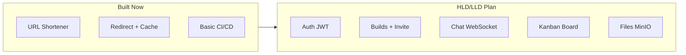
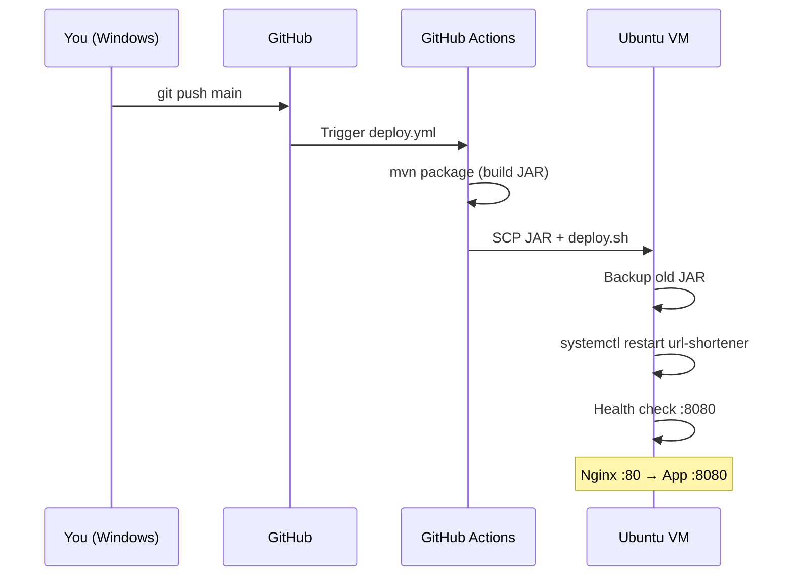
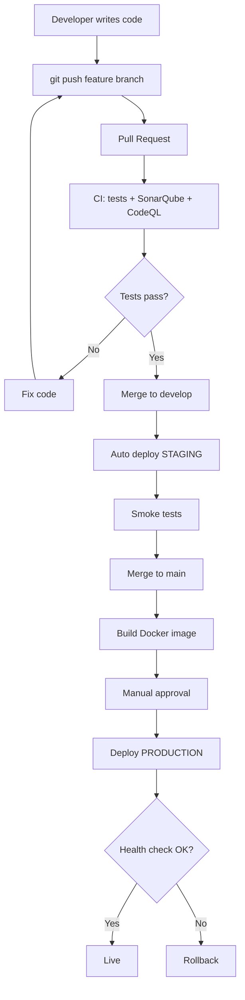

Here is a complete guide based on your **HLD** and **LLD**, covering features, speed, deployment, and full-stack interview prep.

---

# 1. Features: What You Have vs What HLD/LLD Plans

## ✅ Built today (Phase 0 — in code)

| Feature | Module | How it works |
|---------|--------|--------------|
| URL shortening | `shortener` | Auto-increment ID → Base62 code |
| URL redirect | `RedirectController` | `GET /{code}` → 302 to original URL |
| Duplicate URL dedup | `UrlShorteningService` | SHA-256 hash lookup |
| Click stats | `/api/stats/{code}` | Count redirects |
| In-memory cache | Caffeine | Fast redirect without DB hit |
| Web UI | `index.html` | Simple shorten form |
| H2 file database | `data/urlshortener.mv.db` | Persists short links |
| Basic CI/CD | GitHub Actions | Push → build → deploy to VM |
| Nginx + systemd | VM deploy | Public access on port 80 |

## 📋 Planned in HLD/LLD (not built yet)

| Feature | Module | LLD reference |
|---------|--------|---------------|
| User register / login | `auth` | JWT + Spring Security |
| Create workspace ("Build") | `build` | Builds table + invite code |
| Join via invite link | `build` | `POST /join/{code}` |
| Roles (Owner/Admin/Member) | `build` | RBAC per Build |
| Real-time group chat | `chat` | WebSocket + STOMP + Redis |
| Online presence | `chat` | Redis SET — who's online |
| Kanban board | `board` | Columns + drag cards |
| File upload/download | `file` | MinIO S3 bucket |
| Shortener per Build | `shortener` | `build_id` on url_mappings |
| @mentions, notifications | Phase 8 | Activity feed |
| API docs | Swagger | `/swagger-ui.html` |



---

# 2. Popular Features Worth Adding (resume + user value)

| Feature | Like | Interview value | Speed impact |
|---------|------|-----------------|--------------|
| **Real-time chat** | WhatsApp/Slack | ⭐⭐⭐⭐⭐ | WebSocket = instant |
| **Invite link** | Discord | ⭐⭐⭐⭐ | One API call |
| **Kanban board** | Trello | ⭐⭐⭐⭐ | Optimistic UI |
| **File sharing** | Google Drive | ⭐⭐⭐⭐ | Presigned URLs |
| **JWT auth** | Every SaaS | ⭐⭐⭐⭐⭐ | Redis session cache |
| **@mentions** | Slack | ⭐⭐⭐ | Async via Kafka |
| **Search** | Slack | ⭐⭐⭐⭐ | PostgreSQL full-text |
| **Notifications** | WhatsApp | ⭐⭐⭐⭐ | WebSocket push |
| **Activity feed** | GitHub | ⭐⭐⭐ | Event log table |

**Best combo for your project:** Auth → Builds → Chat → Board → Files → Shortener tab.

---

# 3. How to Make It Fast (click → instant response)

HLD target: **chat < 200ms**, API **< 100ms** for most calls.

## Backend speed

| Technique | Where in your app | Effect |
|-----------|-------------------|--------|
| **Redis cache** | Redirect URLs, user sessions, build membership | Skip DB on hot path |
| **Caffeine cache** | Already on shortener | O(1) redirect lookup |
| **DB indexes** | `short_code`, `invite_code`, `build_id` (LLD §9) | Fast queries |
| **Connection pooling** | HikariCP (Spring Boot default) | Reuse DB connections |
| **Pagination** | Chat history: last 50 messages | Don't load full history |
| **WebSocket for chat** | Not REST polling | Push on send, no refresh |
| **Async processing** | Kafka for notifications | Main request returns fast |
| **CDN / Nginx static** | React build files | UI loads from edge |
| **Gzip compression** | Nginx `gzip on` | Smaller responses |
| **DTO projection** | Don't return full entities | Less JSON to serialize |

## Frontend speed

| Technique | Effect |
|-----------|--------|
| **React + TanStack Query** | Cache API responses client-side |
| **Optimistic UI** | Show message/card move before server confirms |
| **Lazy load tabs** | Load chat only when Chat tab opened |
| **Debounce search** | Wait 300ms before API call |
| **WebSocket, not polling** | No `setInterval` every 2 seconds |

## Architecture for speed (from HLD)

```
User clicks "Send message"
    → WebSocket (no HTTP round-trip wait)
    → Save to PostgreSQL (async feel)
    → Redis pub/sub broadcast
    → Other users see in < 200ms

User clicks short link
    → Caffeine cache hit → redirect (no DB)
    → Cache miss → DB index lookup → cache → redirect
```

## NFR targets (HLD §2)

| Metric | Target |
|--------|--------|
| API response (p95) | < 100ms |
| Chat delivery | < 200ms |
| Page load (UI) | < 2s |
| Redirect | < 50ms (cached) |

---

# 4. Deployment Process (end-to-end)

Based on HLD §5 and CICD-ARCHITECTURE.md:

## Current flow (what you have now)



## Target industrial flow (full HLD)



## Step-by-step deploy (production VM)

| Step | Command / action |
|------|------------------|
| 1 | Push code to GitHub `main` |
| 2 | GitHub Actions runs `mvn verify` + `mvn package` |
| 3 | JAR copied to VM `/opt/url-shortener/` |
| 4 | `deploy.sh` backs up old JAR |
| 5 | `systemctl restart url-shortener` |
| 6 | Check `/actuator/health` → UP |
| 7 | Nginx routes `teamhub.local` → `:8080` |
| 8 | Users access via browser |

## Full stack on VM (target HLD)

```
Ubuntu VM
├── Nginx          :80/443  (TLS, reverse proxy)
├── Spring Boot    :8080   (JAR or Docker)
├── PostgreSQL     :5432   (users, builds, chat, board)
├── Redis          :6379   (cache, pub/sub, sessions)
├── MinIO          :9000   (file storage)
└── Prometheus     :9090   (metrics — optional)
```

---

# 5. Full Stack Interview Prep — Questions & Answers

Use your **Team Hub** project as the answer for every question below.

---

## A. Spring Boot / Java

| Question | Answer (using your project) |
|----------|----------------------------|
| What is Spring Boot? | Auto-configures Spring apps. Our JAR embeds Tomcat — run with `java -jar`, no external server. |
| Monolith vs microservices? | We use a **modular monolith** (auth, build, chat, board, file packages). Extract chat to microservice at scale (HLD §9). |
| How does JWT work? | Login → server signs token with secret → client sends `Authorization: Bearer` on every request → `JwtFilter` validates. |
| JPA vs JDBC? | We use JPA/Hibernate for entities like `UrlMapping`, `Build`, `ChatMessage`. Flyway handles schema migrations. |
| What is `@Transactional`? | Wraps DB operations in one unit. Shorten URL: save row + assign Base62 code = one transaction. |

---

## B. System Design (HLD/LLD rounds)

| Question | Answer |
|----------|--------|
| Design a URL shortener | Counter + Base62 (our approach). Index on `short_code`. Caffeine cache for redirects. |
| Design a chat system | WebSocket/STOMP per Build room. Save to PostgreSQL. Redis pub/sub for multi-instance broadcast. |
| How do 1000 users chat in one room? | WebSocket connections + Redis pub/sub. Partition by `build_id`. Horizontal scale with multiple app instances. |
| SQL vs NoSQL? | PostgreSQL for relational data (users, members, messages). MinIO for files. Redis for cache — polyglot persistence. |
| CAP theorem? | Chat favors **AP** (availability + partition tolerance). Banking would be **CP**. |

---

## C. Docker

| Question | Answer |
|----------|--------|
| What is Docker? | Packages app + dependencies into an image. Runs the same on laptop and VM. |
| Dockerfile vs docker-compose? | Dockerfile = build one image. Compose = run app + PostgreSQL + Redis + MinIO + Nginx together. |
| What is multi-stage build? | Stage 1: Maven builds JAR. Stage 2: Only JRE + JAR in final image (smaller, more secure). |
| Docker vs VM? | VM = full OS. Container = shared kernel, lighter, faster start. |
| How do you deploy with Docker? | `docker build` → push to GHCR → VM `docker pull` → `docker compose up -d`. |

**Scenario:** *"Deploy your app with Docker"*  
→ Use our `Dockerfile` + `docker-compose.yml`. App talks to PostgreSQL/Redis/MinIO by service name.

---

## D. Kubernetes

| Question | Answer |
|----------|--------|
| What is Kubernetes? | Orchestrates containers across machines. Auto-restart, scale, load balance. |
| Pod, Deployment, Service? | **Pod** = one or more containers. **Deployment** = manages pod replicas. **Service** = stable network endpoint. |
| Ingress? | Routes external HTTP to services. Like Nginx inside K8s. |
| How does K8s help your app? | Scale chat service to 3 pods. HPA adds pods when CPU > 70%. Rolling update = zero downtime. |
| K8s vs Docker Compose? | Compose = one machine, dev/small prod. K8s = multi-node, production scale. |

**Scenario:** *"Scale your chat app"*  
→ Deployment with 3 replicas. Redis pub/sub so all pods broadcast messages. Ingress routes WebSocket traffic.

---

## E. Kafka

| Question | Answer |
|----------|--------|
| What is Kafka? | Distributed event streaming. Producers publish events; consumers process async. |
| Kafka vs Redis pub/sub? | Kafka = persistent, replay, high throughput. Redis = fast, in-memory, simpler. |
| When use Kafka in Team Hub? | `message.sent` → notification service. `file.uploaded` → activity feed. `card.moved` → audit log. |
| Topic, partition, consumer group? | **Topic** = `chat-events`. **Partition** = parallel reads. **Consumer group** = each message processed once per group. |
| What if consumer fails? | Offset not committed → retry. Dead letter topic for failed messages after 3 retries. |

**Scenario:** *"User sends message — how to notify offline users?"*  
→ Chat service publishes `message.sent` to Kafka → Notification consumer sends email/push without blocking chat API.

---

## F. Jenkins vs GitHub Actions (CI/CD)

| Question | Answer |
|----------|--------|
| What is CI/CD? | **CI** = auto test on every commit. **CD** = auto deploy when tests pass. |
| Jenkins vs GitHub Actions? | Jenkins = self-hosted, plugins, common in enterprises. GitHub Actions = YAML in repo, free for public repos. |
| Your pipeline stages? | Checkout → `mvn verify` → SonarQube → build JAR/Docker → deploy → health check → rollback on fail. |
| What is blue-green deploy? | Two environments: blue (live), green (new). Switch traffic after green health check. Zero downtime. |
| What is rollback? | Our `deploy.sh` backs up JAR. If health check fails → restore backup → restart. |

**Scenario:** *"A bad deploy breaks production"*  
→ Health check fails on `/actuator/health` → `deploy.sh` restores previous JAR → `systemctl restart` → alert team. RTO < 2 min.

---

## G. Testing (scenario-based)

| Scenario | Test type | Example |
|----------|-----------|---------|
| Base62 encode/decode | Unit test | `Base62Test` — already in project |
| User registers with invalid email | Unit + API | `MockMvc` → expect 400 |
| User joins Build via invite | Integration | Testcontainers PostgreSQL → join → verify `build_members` row |
| Send chat message | WebSocket test | Connect STOMP → send → assert broadcast received |
| Redirect short URL | API test | `GET /abc` → expect 302 Location header |
| File upload too large | API test | POST 60MB file → expect 413 |
| DB down on startup | Integration | Testcontainers stop → `/actuator/health` → DOWN |
| 100 concurrent redirects | Load test | k6 script — p95 < 100ms |

**Test pyramid for your project:**
```
        /  E2E  \          Playwright: login → create build → chat
       / Integration \     Testcontainers: real PostgreSQL + Redis
      /   Unit tests   \    JUnit + Mockito: services, Base62, JWT
```

---

## H. Database / Redis / PostgreSQL

| Question | Answer |
|----------|--------|
| Why PostgreSQL over H2? | H2 = dev only. PostgreSQL = production, concurrent users, backups, full-text search. |
| What indexes do you need? | `short_code`, `invite_code`, `(build_id, created_at)` on messages — LLD §9. |
| Redis use cases? | Session cache, chat pub/sub, rate limiting, online presence SET. |
| ACID? | PostgreSQL guarantees Atomicity, Consistency, Isolation, Durability for chat messages, memberships. |
| N+1 query problem? | Use `@EntityGraph` or JOIN FETCH when loading Build + members + cards. |

---

## I. Frontend (React / Full Stack)

| Question | Answer |
|----------|--------|
| REST vs WebSocket? | REST for CRUD (create build, list files). WebSocket for real-time chat. |
| How does React talk to Spring Boot? | Axios/fetch for REST. STOMP.js for WebSocket. JWT in `Authorization` header. |
| CORS? | Spring `@CrossOrigin` or Nginx proxy so browser allows API calls. |
| State management? | TanStack Query for server state. useState for UI state. |
| Optimistic UI? | Show message in chat immediately; rollback if API fails. |

---

## J. DevOps / Nginx / Security

| Question | Answer |
|----------|--------|
| Why Nginx? | TLS termination, reverse proxy, static files, load balancing, gzip. |
| HTTPS setup? | Let's Encrypt cert on Nginx. Spring Boot stays HTTP internally on :8080. |
| Where are secrets stored? | GitHub Secrets → env vars on VM. Never in `application.yml` in git. |
| RBAC in your app? | OWNER can delete Build. ADMIN can remove members. MEMBER can chat and upload. |
| Rate limiting? | Redis token bucket: 100 requests/min per user. |

---

# 6. Interview answer map — link everything to your project

When asked *"Tell me about a project"*:

> **"I built Team Hub — a self-hosted collaboration platform on Spring Boot 3."**
>
> - **HLD:** Modular monolith with Nginx, PostgreSQL, Redis, MinIO on Ubuntu VM  
> - **LLD:** Package-by-feature — auth, build, chat, board, file, shortener modules  
> - **Built:** URL shortener with Base62, Caffeine cache, CI/CD via GitHub Actions  
> - **Planned:** Real-time chat (WebSocket + Redis), kanban board, file sharing  
> - **DevOps:** GitHub Actions CI/CD, Docker, deploy script with rollback  
> - **Design docs:** HLD and LLD for system design discussions  

---

# 7. Quick reference — what to study per topic

| Topic | Study focus | Your project example |
|-------|-------------|----------------------|
| **Docker** | Dockerfile, Compose, multi-stage | `Dockerfile`, `docker-compose.yml` |
| **Kubernetes** | Pod, Deployment, Service, Ingress | Phase 10 — Helm chart |
| **Kafka** | Topics, consumers, event-driven | `message.sent` notification flow |
| **Jenkins** | Pipelines, stages, agents | Same stages as GitHub Actions |
| **CI/CD** | Test → build → deploy → rollback | `.github/workflows/`, `deploy.sh` |
| **Testing** | Unit, integration, E2E, load | `Base62Test`, Testcontainers plan |
| **HLD** | Components, NFRs, scale path | `docs/HLD.md` |
| **LLD** | Classes, APIs, DB, sequences | `docs/LLD.md` |
| **Redis** | Cache, pub/sub, rate limit | Chat broadcast, session cache |
| **PostgreSQL** | Schema, indexes, migrations | LLD ERD, Flyway |

---

# 8. Recommended next steps

| Priority | Action |
|----------|--------|
| 1 | Memorize HLD diagram (browser → Nginx → Spring Boot → PG/Redis/MinIO) |
| 2 | Practice LLD sequence: "User sends chat message" |
| 3 | Build Phase 1 (Auth + PostgreSQL) — adds JWT interview story |
| 4 | Add Testcontainers integration test — strong differentiator |
| 5 | Practice 30-second CI/CD explanation from section 4 |
